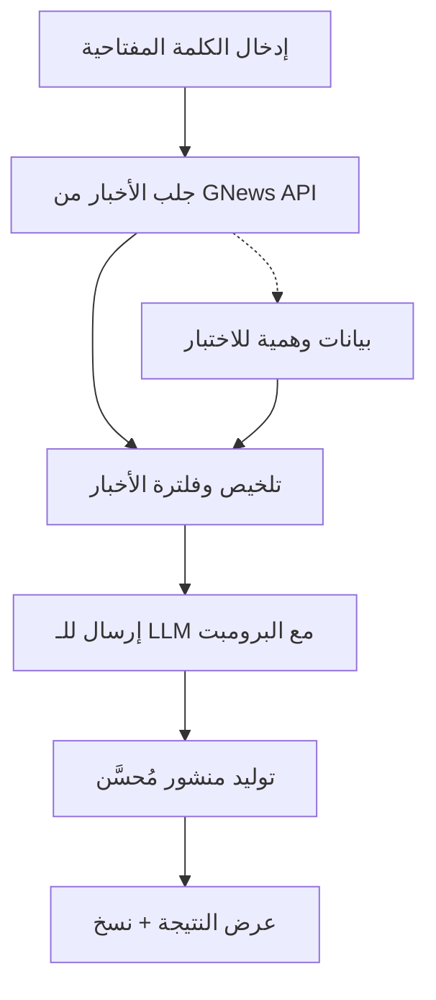

# 🚀 مولد منشورات LinkedIn الفيروسية - دليل شامل

## 🎯 نظرة عامة

تم إنشاء أداة ذكية تستخدم الذكاء الاصطناعي لتوليد منشورات LinkedIn فيروسية بناءً على آخر الأخبار والتريندات. الأداة تدعم عدة طرق للنشر وتعمل بفعالية على GitHub Pages.

## 📁 هيكل المشروع

```
amrikyy-ai/
├── frontend/
│   ├── src/app/linkedin-generator/          # صفحة الأداة في Next.js
│   ├── src/components/linkedin/             # مكونات الأداة
│   ├── src/components/navigation/           # شريط التنقل
│   └── src/app/api/                        # APIs للأخبار وتوليد المنشورات
├── linkedin-generator-standalone/           # نسخة مستقلة للنشر السريع
│   ├── index.html                          # الصفحة الرئيسية
│   ├── script.js                          # منطق التطبيق
│   └── README.md                          # دليل النشر
├── .github/workflows/                      # GitHub Actions للنشر التلقائي
└── scripts/deploy-linkedin-generator.sh    # سكريبت النشر
```

## ✨ المميزات المتقدمة

### 🔍 جلب الأخبار المتقدم
- **API متقدم**: استخدام GNews API للحصول على أخبار حقيقية
- **بيانات وهمية**: تعمل بدون API للاختبار
- **فلترة ذكية**: اختيار أفضل 3-5 أخبار ذات صلة
- **تصنيف زمني**: ترتيب الأخبار حسب الأحدث

### 🤖 توليد محتوى ذكي
- **3 أنماط مختلفة**: تحفيزية، تقنية، قصصية
- **برومبت محترف**: مُحسَّن لزيادة التفاعل
- **هاشتاغات ذكية**: توليد تلقائي للهاشتاغات المناسبة
- **تحكم في الطول**: منشورات محسّنة (150 كلمة)

### 🎨 واجهة مستخدم متقدمة
- **تصميم متجاوب**: يعمل على جميع الأجهزة
- **ألوان متدرجة**: تصميم جذاب ومهني
- **رسوم متحركة**: تفاعل سلس ومريح
- **RTL**: دعم كامل للغة العربية

## 🚀 خيارات النشر

### 1. نشر Next.js (الميزات الكاملة)
```bash
cd frontend
npm install
npm run build
# رفع محتويات مجلد 'out' إلى GitHub Pages
```

**المميزات:**
- ✅ جميع الميزات متاحة
- ✅ APIs حقيقية للأخبار
- ✅ توليد محتوى متقدم
- ❌ يتطلب إعداد API keys

### 2. نشر مستقل (بدون APIs)
```bash
./scripts/deploy-linkedin-generator.sh
# اختر الخيار 2
```

**المميزات:**
- ✅ نشر فوري بدون إعداد
- ✅ يعمل على GitHub Pages مباشرة
- ✅ بيانات وهمية للاختبار
- ❌ لا يحتوي على أخبار حقيقية

### 3. نشر تلقائي (GitHub Actions)
```yaml
# تم إعداد Workflow تلقائياً في:
.github/workflows/deploy-github-pages.yml
```

**المميزات:**
- ✅ نشر تلقائي عند كل push
- ✅ إدارة الإصدارات
- ✅ تحديثات سلسة
- ❌ يتطلب إعداد Secrets

## 🔧 إعداد APIs

### GNews API (مجاني)
1. سجل في [gnews.io](https://gnews.io)
2. احصل على API key
3. أضفه في `.env.local`:
```bash
GNEWS_API_KEY=your_key_here
```

### OpenAI API
1. سجل في [platform.openai.com](https://platform.openai.com)
2. احصل على API key
3. أضفه في `.env.local`:
```bash
OPENAI_API_KEY=your_key_here
```

## 📊 مخطط تدفق البيانات



## 🎯 استراتيجية المحتوى الفيروسي

### برومبت احترافي مُحسَّن:
```
أنت خبير استراتيجي لنمو LinkedIn ومُبدع محتوى فيروسي.
مهمتك كتابة منشور LinkedIn فيروسي بناءً على الأخبار التالية:

المتطلبات:
1. ابدأ بخطاف قوي (12 كلمة كحد أقصى)
2. استخدم جمل قصيرة ومؤثرة مع فواصل سطر
3. أضف رؤية عاطفية أو مثيرة للتفكير
4. اختتم بسؤال أو دعوة للعمل
5. أضف 3-5 هاشتاغات ذات صلة
6. اجعله أقل من 150 كلمة
```

### أنماط التونيت:
- **تحفيزية**: محتوى ملهم يركز على الفرص والنمو
- **تقنية**: تحليل عميق بالبيانات والتفاصيل التقنية  
- **قصصية**: سرد شخصي وقصص ملهمة

## 🛠️ التطوير والتخصيص

### إضافة ميزات جديدة:
```typescript
// في linkedin-generator.tsx
const [newFeature, setNewFeature] = useState('')

// إضافة API جديد
const response = await fetch('/api/new-feature', {
  method: 'POST',
  body: JSON.stringify({ data })
})
```

### تخصيص التصميم:
```css
/* في globals.css أو component */
.custom-gradient {
  background: linear-gradient(135deg, #your-colors);
}
```

## 📈 نصائح للحصول على منشورات فيروسية

### 🎯 استراتيجية المحتوى:
1. **التوقيت المثالي**: 9-11 صباحاً، 1-3 عصراً
2. **الكلمات المفتاحية المتداولة**: AI, Blockchain, Tech, Startups
3. **التفاعل السريع**: رد على التعليقات خلال أول ساعة
4. **القصص الشخصية**: أضف تجربتك الشخصية

### 📊 مقاييس النجاح:
- **المشاهدات**: +1000 في أول 24 ساعة
- **التفاعلات**: معدل 5%+ من المشاهدات
- **التعليقات**: 10+ تعليقات جودة
- **المشاركات**: 5+ reshares

## 🔄 التحديثات المستقبلية

### الإصدار 2.0 (قريباً):
- [ ] دعم منصات أخرى (Twitter, Facebook)
- [ ] تحليل الأداء والإحصائيات
- [ ] جدولة المنشورات
- [ ] قوالب محتوى جاهزة
- [ ] AI أكثر تقدماً (GPT-4)

### تحسينات تقنية:
- [ ] PWA للعمل بدون إنترنت
- [ ] قاعدة بيانات للمحتوى المحفوظ
- [ ] تصدير/استيراد المنشورات
- [ ] دعم اللغات المتعددة

## 🤝 المساهمة والدعم

### للمطورين:
```bash
# استنساخ المشروع
git clone https://github.com/cryptojoker710/amrikyy-ai.git
cd amrikyy-ai

# تثبيت التبعيات
cd frontend && npm install

# التطوير المحلي
npm run dev
```

### الإبلاغ عن الأخطاء:
- GitHub Issues: [امريكيي AI Issues](https://github.com/cryptojoker710/amrikyy-ai/issues)
- Email: support@amrikyy.ai

## 📜 الترخيص والحقوق

هذا المشروع مرخص تحت MIT License - يمكنك استخدامه وتطويره بحرية.

---

تطوير: **Amrikyy AI Team** | آخر تحديث: ديسمبر 2024

🌟 **إذا أعجبك المشروع، لا تنس إعطاؤه نجمة على GitHub!**
